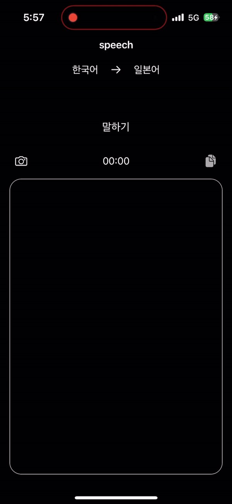

# SpeechToTranslationText
## 일본여행 갈때 쓸려고 만듬ㅇㅇ

 

### 사용기술
- `UIKit`, `SnapKit`, `MLKit`, `Speech`, `SwiftGoogleTranslate`

### 실행화면
| 
 sst Translate 
 | 
 image Translate 
 |
 | -- | -- |
| 
  
 | 
  
 |

